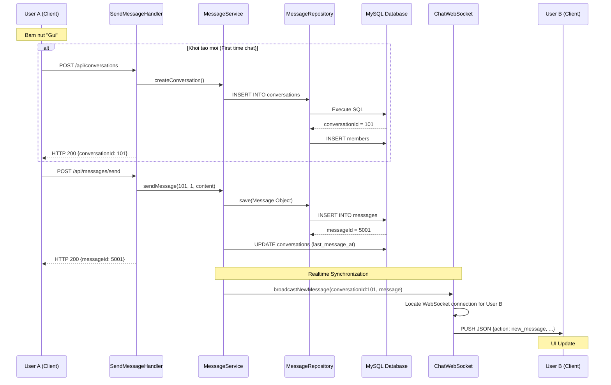

# Luong Gui Tin Nhan Chi Tiet - SinChat System

Tai lieu mo ta quy trinh xu ly du lieu tu thiet bi gui den thiet bi nhan trong he thong SinChat.

---

## 1. Cac kich ban gui tin nhan chinh

| Kich ban | Mo ta | Quy trinh xu ly |
| :--- | :--- | :--- |
| **Khoi tao moi** | Chua co cuoc hoi thoai giua hai nguoi dung | Tao Conversation truoc khi gui tin nhan |
| **Phan hoi** | Cuoc hoi thoai da ton tai | Gui tin nhan truc tiep vao Conversation ID |

---

## 2. Quy trinh khoi tao va gui tin nhan lan dau

Khi User A (id=1) gui tin cho User B (id=2) lan dau tien:

### Buoc 1: Khoi tao Conversation
Client thuc hien yeu cau khoi tao cuoc hoi thoai qua HTTP API:
- **Endpoint**: `POST /api/conversations`
- **Payload**: `{"type": "PRIVATE", "createdBy": 1, "memberIds": [1, 2]}`

Server xu ly:
1. **Handler**: Trich xuat thong tin tu request.
2. **Service**: Kiem tra ton tai va tinh duy nhat cua cuoc hoi thoai PRIVATE.
3. **Repository**: Thuc thi INSERT vao bang `conversations` va `conversation_members`.

### Buoc 2: Gui tin nhan (HTTP Message Send)
Sau khi co `conversationId`, Client gui noi dung tin nhan:
- **Endpoint**: `POST /api/messages/send`
- **Payload**: `{"conversationId": 101, "senderId": 1, "content": "..."}`

Backend xu ly luu tru (Persistence):
1. **SendMessageHandler**: Tiep nhan request HTTP.
2. **MessageService**: Khoi tao doi tuong Message va dieu phoi luu tru.
3. **MessageRepository**: Thuc thi lenh INSERT vao bang `messages`.

### Buoc 3: Dong bo hoa Realtime (WebSocket Push)
Sau khi tin nhan duoc luu an toan vao Database, he thong thuc hien push du lieu:
1. Server xac dinh danh sach thanh vien online trong Conversation.
2. Tim kiem cac ket noi WebSocket tuong ung trong bo nho (Memory Map).
3. Day payload JSON `NEW_MESSAGE` den User B qua kenh WebSocket.
4. Client User B tiep nhan va cap nhat giao dien ngay lap tuc.

---

## 3. So do luong du lieu (Sequence Diagram)

---

## 4. Phan tich vai tro giao thuc

| Tieu chi | HTTP API | WebSocket |
| :--- | :--- | :--- |
| **Trach nhiem** | Persistency (Luu tru du lieu vao Database) | Realtime Delivery (Day tin nhan tuc thi) |
| **Che do ket noi** | Stateless (Mo/Dong theo request) | Stateful (Ket noi duy tri lien tuc) |
| **Huong du lieu** | Unidirectional (Client chu dong) | Bidirectional (Server co the chu dong) |
| **Ung dung** | Dang nhap, dang ky, tai lich su tin nhanh | Nhan tin nhanh, thong bao typing, trang thai online |
