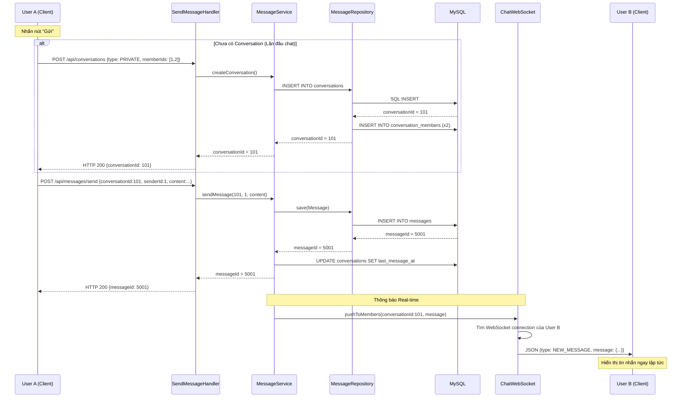

# Luồng Gửi Tin Nhắn Chi Tiết - SinChat

Tài liệu mô tả toàn bộ quy trình từ lúc User A nhấn nút "Gửi" đến khi User B nhận được tin nhắn trên màn hình.

---

## Tổng quan: 2 kịch bản chính

Khi User A muốn gửi tin nhắn cho User B, có **2 trường hợp** xảy ra:

| Trường hợp | Mô tả | Hành động |
|:---|:---|:---|
| **A → B lần đầu** | Chưa có phòng chat nào giữa A và B | Phải tạo Conversation trước, rồi mới gửi tin nhắn |
| **A → B đã chat trước đó** | Phòng chat PRIVATE đã tồn tại | Gửi tin nhắn trực tiếp vào phòng chat cũ |

---

## Kịch bản 1: User A gửi tin nhắn cho User B LẦN ĐẦU TIÊN

> User A (`id=1`, tên `testuser`) muốn nhắn cho User B (`id=2`, tên `admin`) lần đầu.

### Bước 1 — Client gọi API tạo Conversation

Ứng dụng phía Client nhận ra rằng giữa A và B chưa có phòng chat nào. Client sẽ gọi API tạo cuộc hội thoại mới:

```
POST http://localhost:3000/api/conversations
```
```json
{
  "type": "PRIVATE",
  "createdBy": 1,
  "memberIds": [1, 2]
}
```

### Bước 2 — Backend xử lý tạo Conversation

Luồng đi qua 3 tầng:

**① Handler** nhận JSON, parse ra `type`, `createdBy`, `memberIds`.

**② Service** kiểm tra:
- User A và User B có tồn tại trong DB không? → Gọi `UserRepository.findById(1)` và `findById(2)`.
- Giữa A và B đã có conversation PRIVATE nào chưa? → Nếu đã có thì trả về luôn cái cũ, không tạo mới.
- Nếu chưa có → tiếp tục tạo mới.

**③ Repository** thực thi 2 lệnh SQL liên tiếp:

```sql
-- Lệnh 1: Tạo phòng chat
INSERT INTO conversations (type, created_by) VALUES ('PRIVATE', 1);
-- MySQL trả về id = 101 (AUTO_INCREMENT)
```
```sql
-- Lệnh 2: Thêm 2 thành viên vào phòng chat
INSERT INTO conversation_members (conversation_id, user_id, role) VALUES (101, 1, 'MEMBER');
INSERT INTO conversation_members (conversation_id, user_id, role) VALUES (101, 2, 'MEMBER');
```

**Trạng thái Database sau bước này:**

Bảng `conversations`:
| id | type | name | created_by | created_at | last_message_at |
|:---|:---|:---|:---|:---|:---|
| 101 | PRIVATE | NULL | 1 | 2026-05-15 10:00:00 | NULL |

Bảng `conversation_members`:
| conversation_id | user_id | role | joined_at |
|:---|:---|:---|:---|
| 101 | 1 | MEMBER | 2026-05-15 10:00:00 |
| 101 | 2 | MEMBER | 2026-05-15 10:00:00 |

**API trả về cho Client:**
```json
{
  "status": "success",
  "conversationId": 101
}
```

### Bước 3 — Client gọi API gửi tin nhắn

Bây giờ Client đã có `conversationId = 101`, tiến hành gửi tin nhắn:

```
POST http://localhost:3000/api/messages/send
```
```json
{
  "conversationId": 101,
  "senderId": 1,
  "content": "Chào admin, hệ thống ổn không?"
}
```

### Bước 4 — Backend lưu tin nhắn vào Database

**① SendMessageHandler** (Tầng Handler):
- Nhận HTTP request.
- Dùng `Gson` parse JSON body → lấy ra `conversationId=101`, `senderId=1`, `content="Chào admin..."`.
- Gọi `messageService.sendMessage(101, 1, "Chào admin...")`.

**② MessageService** (Tầng Service):
- Tạo đối tượng `Message` mới.
- Set `conversationId = 101`, `senderId = 1`, `type = TEXT`, `content = "Chào admin..."`.
- Gọi `messageRepository.save(message)`.

**③ MessageRepository** (Tầng Repository):
- Lấy Connection từ HikariCP (Connection Pool).
- Thực thi câu SQL:
```sql
INSERT INTO messages (conversation_id, sender_id, type, content) 
VALUES (101, 1, 'TEXT', 'Chào admin, hệ thống ổn không?');
-- MySQL trả về generated key: id = 5001
```
- Trả về `messageId = 5001` cho Service.

**④ Service cập nhật thêm** (tuỳ chọn):
```sql
-- Cập nhật thời gian tin nhắn cuối của phòng chat (để sort danh sách chat)
UPDATE conversations SET last_message_at = NOW() WHERE id = 101;

-- Tạo trạng thái "Đã gửi" cho người nhận
INSERT INTO message_status (message_id, user_id, status) VALUES (5001, 2, 'SENT');
```

**Trạng thái Database sau bước này:**

Bảng `messages`:
| id | conversation_id | sender_id | type | content | created_at |
|:---|:---|:---|:---|:---|:---|
| 5001 | 101 | 1 | TEXT | Chào admin, hệ thống ổn không? | 2026-05-15 10:05:22 |

**API trả về cho Client A:**
```json
{
  "status": "success",
  "messageId": 5001
}
```

### Bước 5 — WebSocket đẩy tin nhắn real-time cho User B

Đây là phần WebSocket phát huy tác dụng:

1. Khi User B mở ứng dụng, ứng dụng tự động tạo kết nối WebSocket tới `ws://localhost:8887`. Kết nối này **luôn mở** (persistent) — khác hoàn toàn với HTTP là đóng ngay sau mỗi request.

2. Server lưu lại kết nối của User B trong bộ nhớ: `Map<userId, WebSocket>` → `{2: WebSocket_of_B}`.

3. Sau khi `MessageRepository` lưu tin nhắn thành công (Bước 4), hệ thống kiểm tra: *"Ai là thành viên của phòng 101?"* → Truy vấn bảng `conversation_members` → Tìm thấy User B (`id=2`).

4. Server tìm kết nối WebSocket của User B trong bộ nhớ và **chủ động đẩy** (push) tin nhắn:
```json
{
  "type": "NEW_MESSAGE",
  "conversationId": 101,
  "message": {
    "id": 5001,
    "senderId": 1,
    "senderName": "testuser",
    "content": "Chào admin, hệ thống ổn không?",
    "createdAt": "2026-05-15T10:05:22"
  }
}
```

5. Ứng dụng của User B nhận được dữ liệu này qua WebSocket → Hiển thị tin nhắn mới lên màn hình **ngay lập tức** mà không cần tải lại trang.

6. Nếu User B đang offline (không có kết nối WebSocket nào), tin nhắn vẫn đã được lưu an toàn trong DB. Khi User B mở app lại, ứng dụng sẽ gọi API `GET /api/messages?conversationId=101` để tải về các tin nhắn mới.

---

## Kịch bản 2: User A gửi tin nhắn cho User B ĐÃ CHAT TRƯỚC ĐÓ

> Phòng chat `conversationId = 101` đã tồn tại từ trước.

Kịch bản này **đơn giản hơn nhiều** vì bỏ qua toàn bộ Bước 1 và 2:

- Client đã lưu sẵn `conversationId = 101` trong bộ nhớ (hoặc load từ danh sách chat).
- Client gọi thẳng API gửi tin nhắn (Bước 3) → Backend lưu DB (Bước 4) → WebSocket đẩy cho B (Bước 5).

---

## Kịch bản 3: Gửi tin nhắn vào nhóm (GROUP)

> Nhóm "Dự án LTM" có `conversationId = 200`, gồm 3 thành viên: User A (id=1), User B (id=2), User C (id=3).

Quy trình **hoàn toàn giống** chat 1-1:
- Client gọi `POST /api/messages/send` với `conversationId = 200`.
- Backend lưu **1 bản ghi duy nhất** vào bảng `messages`.
- WebSocket đẩy tin nhắn cho **tất cả thành viên** (trừ người gửi): Server truy vấn `conversation_members` → tìm thấy User B và C → đẩy tin nhắn cho cả hai qua WebSocket.

> [!IMPORTANT]
> Đây chính là ưu điểm của thiết kế dùng `conversations`: Tin nhắn chỉ lưu 1 lần trong DB bất kể phòng chat có bao nhiêu người.

---

## Sơ đồ tổng hợp (Sequence Diagram)



---

## So sánh vai trò của HTTP API vs WebSocket

| Tiêu chí | HTTP API | WebSocket |
|:---|:---|:---|
| **Vai trò** | Lưu trữ dữ liệu (ghi vào DB) | Thông báo real-time (đẩy tin nhắn) |
| **Hướng giao tiếp** | Client → Server (Client phải chủ động hỏi) | Server → Client (Server chủ động đẩy) |
| **Kết nối** | Mở → Gửi → Nhận → Đóng (mỗi request) | Mở 1 lần, giữ liên tục suốt phiên |
| **Khi nào dùng?** | Gửi tin nhắn, đăng ký, đăng nhập, tải lịch sử | Nhận tin nhắn mới, thông báo typing, online/offline |
| **Nếu không có?** | Không lưu được gì | User B phải F5 liên tục để xem tin mới |

---

## Tóm tắt toàn bộ luồng bằng 1 câu

> User A gọi **HTTP API** để gửi tin nhắn → Backend **lưu vào MySQL** qua 3 tầng (Handler → Service → Repository) → Sau khi lưu thành công, Backend dùng **WebSocket** để đẩy tin nhắn đó tới User B **ngay lập tức**.
