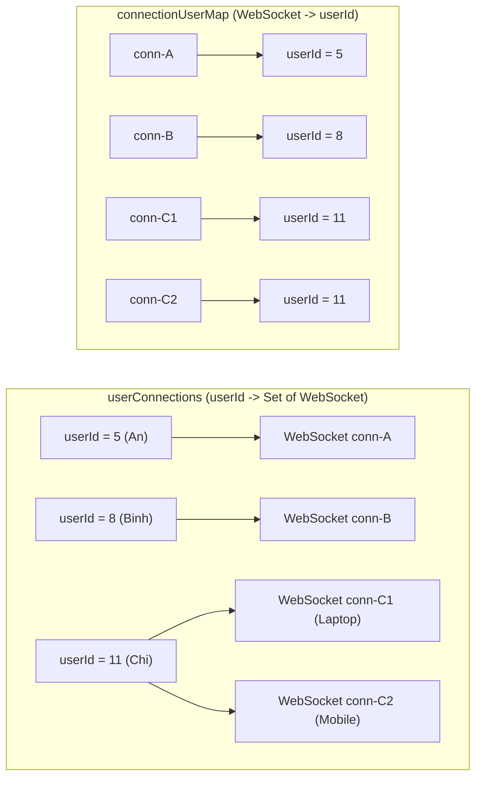
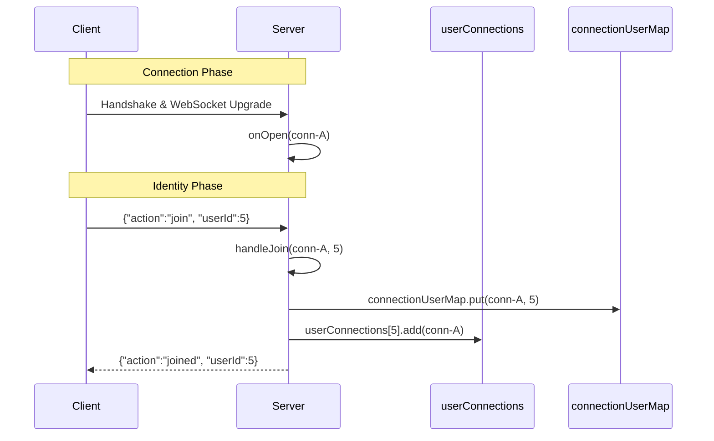
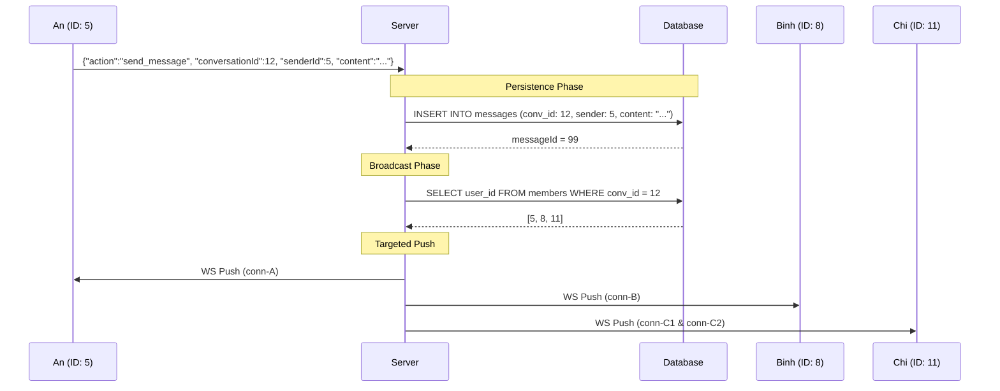
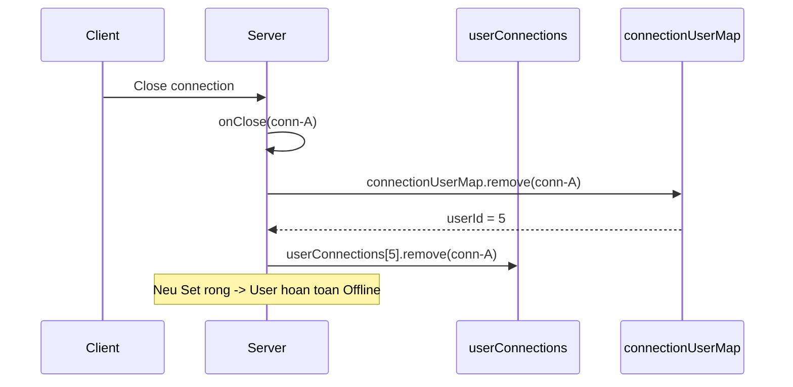

# WebSocket Flow Diagrams - Multi-User Conversation

Kich ban: Conversation ID = 12, bao gom 3 thanh vien: An (ID: 5), Binh (ID: 8), Chi (ID: 11).

---

## 1. Server-Side Data Structures

Server su dung 2 bang bam (ConcurrentHashMap) de quan ly trang thai ket noi:

**Muc dich su dung:**
- **userConnections**: Cho phep Server tim thay tat ca cac ket noi dang mo cua mot nguoi dung cu the de thuc hien gui tin nhan (Targeted Broadcast).
- **connectionUserMap**: Cho phep Server xac dinh nhanh nguoi dung nao vua ngat ket noi de cap nhat trang thai (Resource Cleanup).

---

## 2. Identity Registration Flow (JOIN)

Day la quy trinh xac thuc danh tinh ngay sau khi thiet lap ket noi WebSocket.

---

## 3. Realtime Messaging Flow

Kich ban: An (ID: 5) gui tin nhan den Conversation 12.

---

## 4. Connection Termination (Cleanup)

Quy trinh xu ly khi mot ket noi bi ngat (vi du: User dong trinh duyet).

---

## 5. Code Mapping Reference

| Thanh phan | Package / File | Method |
| :--- | :--- | :--- |
| Identity Mapping | `com.server.websocket.ChatWebSocket` | `handleJoin()` |
| Message Persistence | `com.server.repository.MessageRepository` | `save()` |
| Member Lookup | `com.server.repository.ConversationRepository` | `getMemberIds()` |
| WebSocket Broadcast | `com.server.websocket.ChatWebSocket` | `broadcastToMembers()` |
| Resource Cleanup | `com.server.websocket.ChatWebSocket` | `onClose()` |
