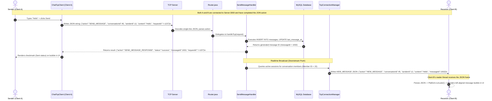

# 💬 Realtime Message Transmission Flow (TCP)

This document describes in detail the end-to-end data flow when a user sends a message from the Client, saves it into the database, and delivers it instantly to the receiver over a raw TCP Socket connection in the SinChat system.

---

## 1. Sequence Diagram: Realtime Message Send & Broadcast

---

## 2. Step-by-Step Execution Details

### Step 1: Client A Sends Message
1.  The user enters text in the text input area and presses Enter or clicks the Send button (➤).
2.  `ChatView.java` of Client A checks if the input is empty. If it is empty, the sending action is aborted.
3.  `ChatTcpClient.java` is invoked using `sendMessage(conversationId, content)`.
4.  The request object is built with the action `"SEND_MESSAGE"` and a unique `requestId` to pair the incoming response.
5.  Client A serializes the request object into a JSON string, appends a newline character (`\n`), and writes it to the Socket `BufferedWriter`.

### Step 2: Server Persistence
1.  **Continuous Read Loop**: The Server listens to Client A's connection on a dedicated pool thread (`ClientConnection.java`).
2.  **Read Frame**: Upon encountering the newline character `\n`, the thread parses the captured string into a `JsonObject` using `Gson`.
3.  **Routing**: `Router.java` receives the object and dispatches it to `SendMessageHandler.java`.
4.  **Verification & Save**:
    *   `SendMessageHandler` validates required fields (`conversationId`, `senderId`, `content`).
    *   `MessageService` saves the message to the database via `MessageRepository.save()`.
    *   All DB transactions are served from the high-performance HikariCP connection pool.
    *   The `last_message_at` field in the `conversations` table is updated concurrently.

### Step 3: Direct Response to Client A
1.  The Server sends a success response back to Client A:
    `{"action": "SEND_MESSAGE_RESPONSE", "requestId": "r-123", "status": "success", "messageId": 1002}\n`
2.  Client A's reading thread receives the response, matches the `requestId` inside `pendingRequests`, and completes the `CompletableFuture`. This notifies the UI to update the bubble status from "sending" to "sent".

### Step 4: Realtime Downstream Broadcast (Client B)
1.  `SendMessageHandler.java` retrieves member IDs of the conversation using `ConversationRepository.getMemberIds(conversationId)`.
2.  For each member ID (excluding the sender, or including all as required):
    *   The handler calls `TcpConnectionManager.getInstance().broadcastToUser(memberId, broadcastMsg)`.
    *   `TcpConnectionManager` searches for active Socket connections mapped to that `memberId` inside a `ConcurrentHashMap` in RAM.
    *   If the user is online, the Server writes the `NEW_MESSAGE` JSON string followed by `\n` directly to the user's socket connection.

### Step 5: Rendering on Client B
1.  The background thread of `ChatTcpClient` on Client B is continually blocking on `readLine()`.
2.  When it reads the `NEW_MESSAGE` frame, it parses it and triggers the registered `onNewMessage` callback.
3.  Using `Platform.runLater()`, Client B's UI thread appends the new message bubble to the active chat screen in real time, delivering a fluid chat experience.
