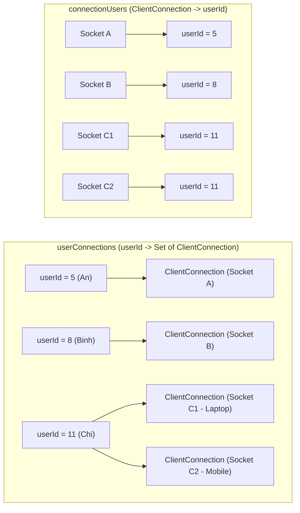
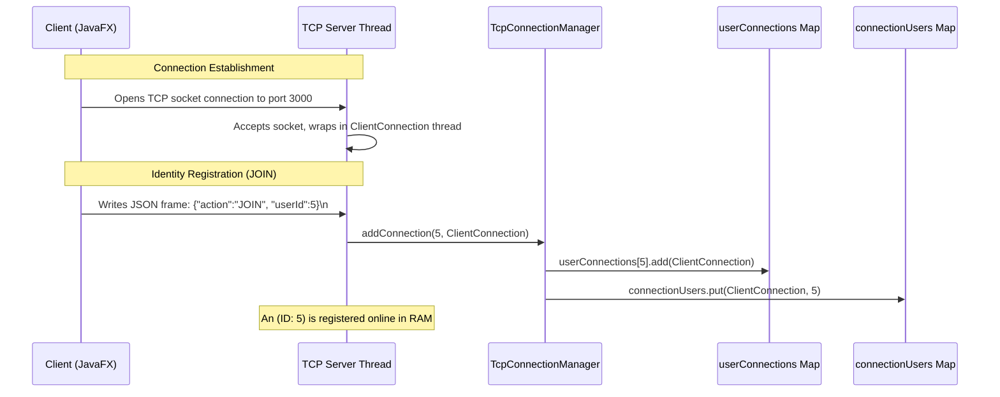
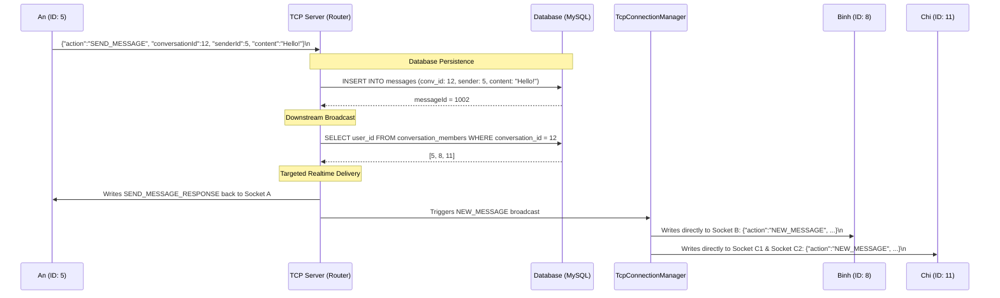
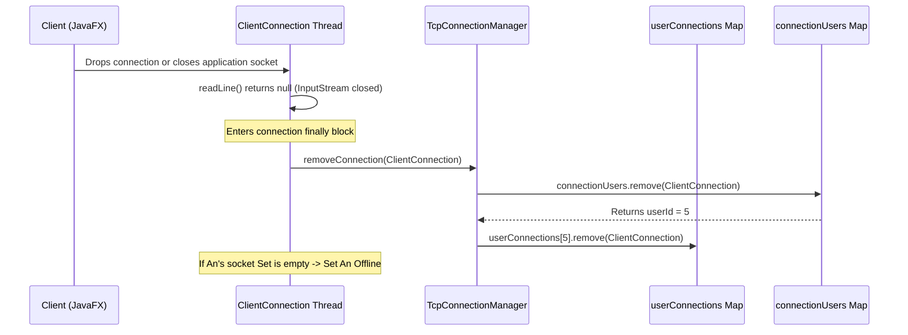

# 📊 TCP Connection & Activity Diagrams

Scenario: Conversation ID = 12, consisting of 3 members: An (ID: 5), Binh (ID: 8), and Chi (ID: 11).

---

## 1. Server RAM Cache Mapping (Stateful Session Management)

The Server manages active socket sessions dynamically in RAM using the `TcpConnectionManager` class to allow fast, real-time downstream deliveries:

**Key Data Structure Roles:**
*   **userConnections Map**: Maps a `userId` to a thread-safe Set of active `ClientConnection` objects, enabling targeted multi-device pushes.
*   **connectionUsers Map**: Maps a single active socket connection back to its owning `userId`, enabling fast cleanup during connection loss.

---

## 2. Identity Registration (JOIN Flow)

This sequence diagrams the connection flow when a client authenticates and registers its socket connection with the Server's memory manager to start receiving push events.

---

## 3. Realtime Downstream Messaging

This sequence illustrates An (ID: 5) sending a message to chat ID 12.

---

## 4. Connection Loss & Cleanup Flow

This sequence diagrams the cleanup operations when a client socket drops or disconnects.

---

## 5. Source Code Mapping Reference

| Operation | Handler Class | Handler Method |
| :--- | :--- | :--- |
| **Session Cache Add** | `com.server.tcp.TcpConnectionManager` | `addConnection()` |
| **Message Save** | `com.server.repository.MessageRepository` | `save()` |
| **Conversation Membership** | `com.server.repository.ConversationRepository` | `getMemberIds()` |
| **Realtime Broadcast Push** | `com.server.tcp.TcpConnectionManager` | `broadcastToUser()` |
| **Session Cache Cleanup** | `com.server.tcp.TcpConnectionManager` | `removeConnection()` |
