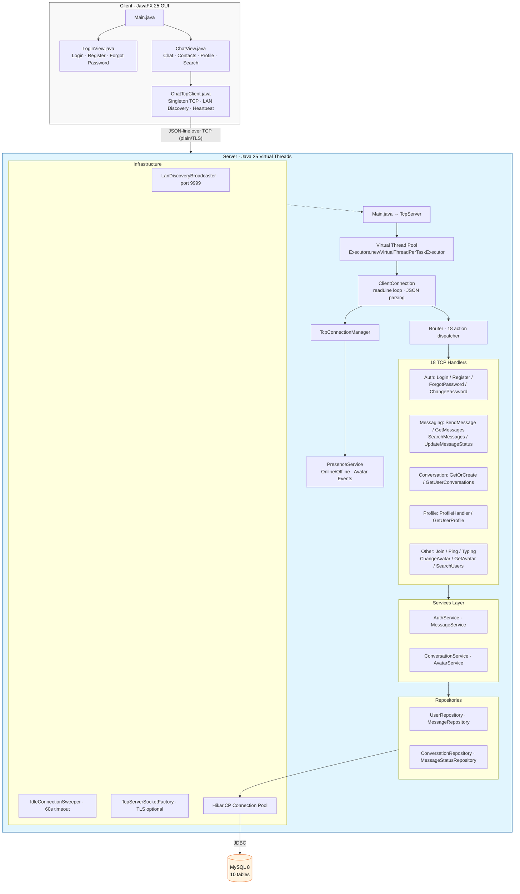

<p align="center">
  <h1 align="center">💬 SinChat</h1>
  <p align="center"><em>A real-time chat application with JavaFX GUI over pure Stateful TCP Sockets</em></p>
</p>

<p align="center">
  
  
  
  
  
  
  
  
</p>

---

## 📖 Overview

**SinChat** is a full-featured chat application built for the *Network Programming* course. It follows a **Client–Server** architecture using **raw TCP sockets** with a custom **JSON-based protocol** (no HTTP/REST, no WebSocket). The client GUI is built with **JavaFX**, and the server is containerized with **Docker** and deployed on [Render](https://render.com/).

---

## ✅ Features

### Authentication
- [x] Login with username & password (BCrypt hashing, rate-limited: 5 attempts → 60s lockout)
- [x] Register new account (with email, input validation)
- [x] Forgot password with 6-digit reset code (5-min TTL, brute-force protection, timing attack mitigation)
- [x] Change password from profile (old password verification)

### Real-time Chat
- [x] Send/receive text messages over Stateful TCP Sockets
- [x] Send rich media: image, video, voice, file (extensible `MessageType`)
- [x] File sharing with attachment support (`attachments` table, metadata stored)
- [x] Typing indicator broadcasts (throttled, 1s min interval)
- [x] Message read receipts (SENT → DELIVERED → SEEN tracking)
- [x] Message search (full-text LIKE search within conversation, with username join)
- [x] Paginated message history (infinite scroll with limit/offset)

### Conversations
- [x] Private one-on-one chat (atomic find-or-create with `SELECT ... FOR UPDATE`)
- [ ] Group chat
- [x] Username search & first-time contact creation
- [x] Last message preview in conversation list
- [x] Conversation history retrieval (with online status & last seen)

### Profile & Presence
- [x] Change avatar (base64 upload, resize to 512×512 PNG, stored as DB BLOB)
- [x] View avatar (base64-encoded BLOB retrieval via `GET_AVATAR`)
- [x] User online/offline status (broadcasted to friends & conversation peers)
- [x] TCP heartbeat keep-alive (PING every 15s)
- [x] Idle connection sweeper (closes idle connections after 60s)
- [x] Update profile (email)
- [ ] Change username

### Network & Infrastructure
- [x] LAN auto-discovery (TCP broadcast on port 9999, subnet sweep)
- [x] Optional TLS/SSL encryption (keystore/truststore configurable)
- [x] Java 25 Virtual Threads (per-connection lightweight threads)
- [x] Multi-device support (same user, multiple concurrent connections)
- [x] Auto-reconnection (retry every 2s with automatic JOIN replay)
- [x] Railway deployment support (`run_client_railway.cmd` with proxy config)

### Calls & Screen Sharing *(planned)*
- [ ] Voice call
- [ ] Video call
- [ ] Screen sharing

---

## 🧱 Technology Stack

| Layer | Technology |
|-------|-----------|
| **Language** | [Java 25](https://www.oracle.com/java/) |
| **GUI** | [JavaFX (OpenJFX) 25](https://openjfx.io/) |
| **Networking** | Raw `java.net.Socket` — Stateful TCP with JSON-line protocol + optional TLS |
| **Concurrency** | [Java 25 Virtual Threads](https://docs.oracle.com/en/java/javase/25/core/virtual-threads.html) (`Executors.newVirtualThreadPerTaskExecutor()`) |
| **Database** | [MySQL 8](https://www.mysql.com/) — hosted on 123host.vn |
| **Connection Pool** | [HikariCP](https://github.com/brettwooldridge/HikariCP) 5.1.0 |
| **Password Hashing** | [jBCrypt](https://www.mindrot.org/projects/jBCrypt/) 0.4 |
| **JSON Serialization** | [Google Gson](https://github.com/google/gson) 2.10.1 |
| **Build** | [Apache Maven](https://maven.apache.org/) (maven-compiler 3.13.0, maven-shade 3.5.0) |
| **Logging** | [SLF4J](https://www.slf4j.org/) 2.0.13 + slf4j-simple |
| **Containerization** | [Docker](https://www.docker.com/) + multi-stage build ([eclipse-temurin:25](https://hub.docker.com/_/eclipse-temurin)) |
| **Hosting** | [Render](https://render.com/) (server) / [Railway](https://railway.app/) (proxy) |
| **Avatar Storage** | Database BLOB (`user_avatars` table, LONGBLOB) |
| **Testing** | JUnit 5.10.2 + Mockito 5.17.0 (16 test files) |

---

## 🏗️ Architecture



### Design Patterns Used
- **Singleton** — `ChatTcpClient`, `TcpConnectionManager`, `PresenceService`, Router handlers
- **Service + Repository** — Clean separation of business logic and data access (4 services, 4 repositories)
- **JSON-RPC style** — `requestId` echoed in response for async request matching with `CompletableFuture`
- **Virtual Threads** — Java 25 Virtual Threads (`Executors.newVirtualThreadPerTaskExecutor()`) for lightweight connection handling (no manual pool sizing needed)
- **Observer (Callbacks)** — `onNewMessage`, `onConnected`, `onDisconnected`, `onUserTyping`, `onUserStatusChange`, `onUserAvatarChanged`, `onMessageStatusChanged` event listeners
- **Model/Entity** — Plain Java objects with enums for type safety (8 model classes, 4 enums)
- **LAN Discovery** — TCP probe on port 9999 with subnet sweep for zero-config client setup
- **Rate Limiting** — Login attempt throttling (5 attempts → 60s lockout), forgot-password brute-force protection (5 attempts per code)

---

## ⚙️ Running the Application

### One-Click Launch (Windows)

| Action | File |
|--------|------|
| Start server | Double-click **`Extra/run_server.cmd`** |
| Start client (direct) | Double-click **`Extra/run_client.cmd`** |
| Start client (LAN discovery) | Double-click **`Extra/run_client_lan.cmd`** |
| Start client (Railway proxy) | Double-click **`Extra/run_client_railway.cmd`** |

### Manual Launch with Maven

#### 1. Start the TCP Server
```powershell
cd Code/Server
mvn compile
mvn exec:java -Dexec.mainClass="com.server.Main"
```

#### 2. Start the JavaFX Client
```powershell
cd Code/Client
mvn compile
mvn javafx:run
```

The client supports three connection modes:
- **Direct** (default) — connects to `localhost:3000`
- **LAN Discovery** — probes subnet on port 9999, auto-detects server via `SINCHAT_SERVER:<port>` response
- **Railway Proxy** — connects to `acela.proxy.rlwy.net:45139`

### Docker (Full Stack)
```powershell
cd Extra
docker-compose up --build
```
This starts both the SinChat server (port 3000) and a MySQL 8 database (port 3306) with the schema auto-initialized.

### Docker (Server Only — Multi-stage)
```powershell
cd Code/Server
docker build -t sinchat-server .
docker run -p 3000:3000 sinchat-server
```
The Dockerfile uses a multi-stage build with `eclipse-temurin:25`, building a fat JAR via `maven-shade-plugin`.

---

## 👥 Team Members & Work Distribution

| Member | Role | Primary Contributions |
|--------|------|----------------------|
| **[Nguyen Sun Sin](https://github.com/ngnsusinn)** | **Team Lead · Backend Core · DevOps** | Server architecture (TcpServer, Router, ClientConnection), TCP heartbeat/TLS/presence/idle sweeper, forgot-password API (timing attack mitigation, rate limiting, brute-force protection), HikariCP connection pooling, BCrypt auth, Docker + Render deployment, Maven build setup, Windows launch scripts, server unit/integration tests (16 test suites), README & documentation, last-message preview UI, username search & contact creation, typing broadcasts, LAN auto-discovery, Railway proxy support, virtual threads migration |
| **[Tran Van Thai](https://github.com/ThaiDevv)** | **Project Owner · Messaging · Database** | Database schema design (10 tables), message models & repositories, send/receive message flow, conversation private checks, dynamic contacts UI, architectural overhaul & message flow optimization, project structure refactoring, .env setup, PR reviews & merges (maintainer), message search implementation, message read receipt integration |
| **[Nguyen Le Huy Tam](https://github.com/Sleepy2608)** | **UI Developer · Avatar** | JavaFX client GUI (LoginView, ChatView, Main), AI-powered avatar change feature integration, ChatView bug fixes (auto-scroll, message display), UI iterative improvements, conflict resolution for avatar feature branch, dark theme design |
| **[Nguyen Ngoc Gia Bao](https://github.com/Baon5824)** | **Endpoint Integration** | Connect backend endpoints with JavaFX UI, ChatAuthApp code, TCP endpoint cleanup & refactoring, message read receipt implementation (bulk SEEN updates) |
| **[Tran Van Ngoc Thang](https://github.com/Thang414)** | **Auth · Avatar** | Register account feature, change avatar feature (base64 upload, crop/zoom UI), avatar endpoint updates |
| **[Huynh Dinh Chan](https://github.com/Chan-2006)** | **Profile Management** | ProfileHandler API (get/update profile, email), profile endpoint implementation, message read receipt contributions |

## 📚 Documentation

- [System Architecture](Docs/01_System_Architecture.md) — High-level design & component overview
- [TCP API Protocol](Docs/02_TCP_API_Protocol.md) — JSON message format & action reference (18 actions + 5 server events)
- [Realtime Message Flow](Docs/03_Realtime_Message_Flow.md) — End-to-end message delivery
- [Server Guide](Docs/04_Server_Guide.md) — Server setup, config, & deployment
- [Client Guide](Docs/05_Client_Guide.md) — Client architecture & usage
- [Forgot Password Flow](Docs/06_Forgot_Password_Flow.md) — Reset code mechanism
- [TCP Activity Diagrams](Docs/07_TCP_Activity_Diagrams.md) — Sequence/activity diagrams
- [Missing Features & Upgrades](Docs/08_Missing_Features_and_Network_Upgrades.md) — Roadmap & improvements
- [Change Password TCP Implementation](Docs/10_Change_Password_TCP_Implementation.md) — Change password flow
- [Message Search TCP Implementation](Docs/11_Message_Search_TCP_Implementation.md) — Search flow & pagination
- [Codebase Structure](Docs/CODEBASE_STRUCTURE.md) — File tree and architecture overview
- [Java Files Reference](Docs/JAVA_FILES_REFERENCE.md) — Quick file listing with descriptions (40+ Java files)

## 🧪 Testing

The project includes **16 test suites** across three categories:

| Category | Count | Coverage |
|----------|-------|----------|
| **Unit tests (handlers)** | 2 | RegisterHandler, ForgotPasswordHandler |
| **Unit tests (services)** | 3 | AuthService, MessageService, ConversationService |
| **Unit tests (models)** | 7 | User, Message, Conversation, Attachment, MessageStatus, Friendship, ChangeAvatar |
| **Integration tests** | 4 | Auth, Endpoint, Message, Additional endpoints |

Run tests:
```powershell
cd Code/Server
mvn test
```

## 🔐 Security Features

| Feature | Implementation |
|---------|---------------|
| **Password hashing** | BCrypt (jBCrypt 0.4) |
| **SQL injection prevention** | PreparedStatement everywhere |
| **Login rate limiting** | 5 failed attempts → 60s account lockout |
| **Forgot password protection** | 6-digit SecureRandom code, 5-min TTL, max 5 attempts per code |
| **Timing attack mitigation** | BCrypt dummy hash comparison for user enumeration prevention |
| **Authorization checks** | Conversation membership verification on all message operations |
| **TLS/SSL support** | Optional keystore/truststore-based encryption via `TcpServerSocketFactory` |
| **Input validation** | Username (3-50 chars), password (6+), email regex, message length (10K max)

---

<p align="center">
  <sub>Built with ❤️ for the Network Programming course — UTH, 2026</sub>
</p>