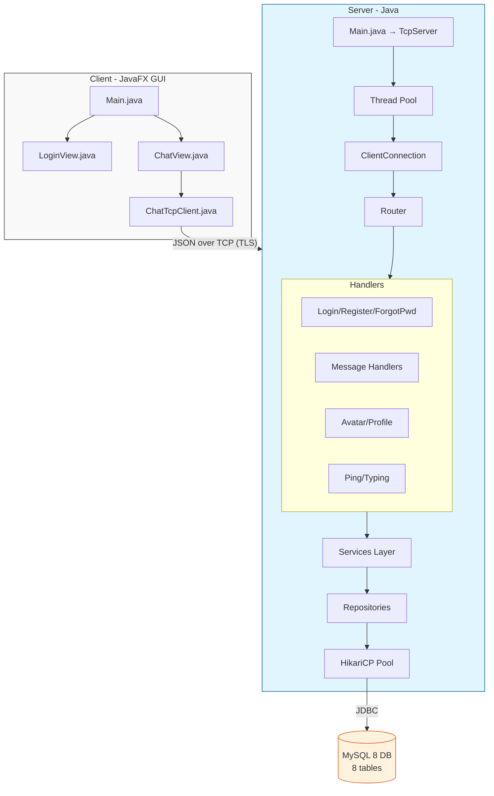

<p align="center">
  <h1 align="center">💬 SinChat</h1>
  <p align="center"><em>A real-time chat application with JavaFX GUI over pure Stateful TCP Sockets</em></p>
</p>

<p align="center">
  
  
  
  
  
  
</p>

---

## 📖 Overview

**SinChat** is a full-featured chat application built for the *Network Programming* course. It follows a **Client–Server** architecture using **raw TCP sockets** with a custom **JSON-based protocol** (no HTTP/REST, no WebSocket). The client GUI is built with **JavaFX**, and the server is containerized with **Docker** and deployed on [Render](https://render.com/).

---

## ✅ Features

### Authentication
- [x] Login with username & password (BCrypt hashing)
- [x] Register new account (with email)
- [x] Forgot password with 6-digit reset code

### Real-time Chat
- [x] Send/receive text messages over Stateful TCP Sockets
- [x] Send rich media: image, video, voice, file
- [x] File sharing with attachment support
- [x] Typing indicator broadcasts
- [x] Message read receipts (SEEN status)

### Conversations
- [x] Private one-on-one chat
- [ ] Group chat
- [ ] Username search & first-time contact creation
- [x] Last message preview in conversation list
- [x] Conversation history retrieval

### Profile & Presence
- [x] Change avatar
- [x] User online/offline status
- [x] TCP heartbeat keep-alive
- [x] Idle connection sweeper
- [ ] Change password from profile
- [ ] Change username

### Calls & Screen Sharing *(planned)*
- [ ] Voice call
- [ ] Video call
- [ ] Screen sharing

---

## 🧱 Technology Stack

| Layer | Technology |
|-------|-----------|
| **Language** | [Java 25](https://www.oracle.com/java/) |
| **GUI** | [JavaFX (OpenJFX) 24](https://openjfx.io/) |
| **Networking** | Raw `java.net.Socket` — Stateful TCP with JSON-line protocol + TLS |
| **Database** | [MySQL 8](https://www.mysql.com/) — hosted on 123host.vn |
| **Connection Pool** | [HikariCP](https://github.com/brettwooldridge/HikariCP) |
| **Password Hashing** | [BCrypt](https://www.mindrot.org/projects/jBCrypt/) |
| **JSON Serialization** | [Google Gson](https://github.com/google/gson) |
| **Build** | [Apache Maven](https://maven.apache.org/) |
| **Containerization** | [Docker](https://www.docker.com/) + [docker-compose](https://docs.docker.com/compose/) |
| **Hosting** | [Render](https://render.com/) (server) |
| **Image Hosting** | [ImgBB](https://imgbb.com/) (avatars) |
| **Testing** | JUnit 5 + Mockito |

---

## 🏗️ Architecture



### Design Patterns Used
- **Singleton** — `ChatTcpClient`, `Database`, Router handlers
- **Service + Repository** — Clean separation of business logic and data access
- **JSON-RPC style** — `requestId` echoed in response for async request matching
- **Thread Pool** — 100 concurrent connections via `ExecutorService`
- **Observer (Callbacks)** — `onNewMessage`, `onConnected`, `onDisconnected` event listeners
- **Model/Entity** — Plain Java objects with enums for type safety

---

## ⚙️ Running the Application

### One-Click Launch (Windows)

| Action | File |
|--------|------|
| Start server | Double-click **`Extra/run_server.cmd`** |
| Start client | Double-click **`Extra/run_client.cmd`** |

### Manual Launch with Maven

#### 1. Start the TCP Server
```powershell
cd Code/Server
mvn compile
mvn exec:java -Dexec.mainClass="com.server.Main"
```

#### 2. Start the JavaFX Client
```powershell
cd Code/Client
mvn compile
mvn javafx:run
```

### Docker (Full Stack)
```powershell
cd Extra
docker-compose up --build
```
This starts both the SinChat server (port 3000) and a MySQL 8 database (port 3306) with the schema auto-initialized.

---

## 👥 Team Members & Work Distribution

| Member | Role | Primary Contributions |
|--------|------|----------------------|
| **[Nguyen Sun Sin](https://github.com/ngnsusinn)** | **Team Lead · Backend Core · DevOps** | Server architecture (TcpServer, Router, ClientConnection), TCP heartbeat/TLS/presence/idle sweeper, forgot-password API, HikariCP connection pooling, BCrypt auth, Docker + Render deployment, Maven build setup, Windows launch scripts, server unit/integration tests, README & documentation, last-message preview UI, username search & contact creation, typing broadcasts |
| **[Tran Van Thai](https://github.com/ThaiDevv)** | **Project Owner · Messaging · Database** | Database schema design (8 tables), message models & repositories, send/receive message flow, conversation private checks, dynamic contacts UI, architectural overhaul & message flow optimization, project structure refactoring, .env setup, PR reviews & merges (maintainer) |
| **[Nguyen Le Huy Tam](https://github.com/Sleepy2608)** | **UI Developer · Avatar** | JavaFX client GUI (LoginView, ChatView, Main), AI-powered avatar change feature integration, ChatView bug fixes, UI iterative improvements, conflict resolution for avatar feature branch |
| **[Nguyen Ngoc Gia Bao](https://github.com/Baon5824)** | **Endpoint Integration** | Connect backend endpoints with JavaFX UI, ChatAuthApp code, TCP endpoint cleanup & refactoring, message read receipt implementation |
| **[Tran Van Ngoc Thang](https://github.com/Thang414)** | **Auth · Avatar** | Register account feature, change avatar feature, avatar endpoint updates |
| **[Huynh Dinh Chan](https://github.com/Chan-2006)** | **Profile Management** | ProfileHandler API (get/update profile, username, status), profile endpoint implementation, message read receipt contributions |

## 📚 Documentation

- [System Architecture](Docs/01_System_Architecture.md) — High-level design & component overview
- [TCP API Protocol](Docs/02_TCP_API_Protocol.md) — JSON message format & action reference
- [Realtime Message Flow](Docs/03_Realtime_Message_Flow.md) — End-to-end message delivery
- [Server Guide](Docs/04_Server_Guide.md) — Server setup, config, & deployment
- [Client Guide](Docs/05_Client_Guide.md) — Client architecture & usage
- [Forgot Password Flow](Docs/06_Forgot_Password_Flow.md) — Reset code mechanism
- [TCP Activity Diagrams](Docs/07_TCP_Activity_Diagrams.md) — Sequence/activity diagrams
- [Missing Features & Upgrades](Docs/08_Missing_Features_and_Network_Upgrades.md) — Roadmap & improvements

---

<p align="center">
  <sub>Built with ❤️ for the Network Programming course — UTH, 2026</sub>
</p>
